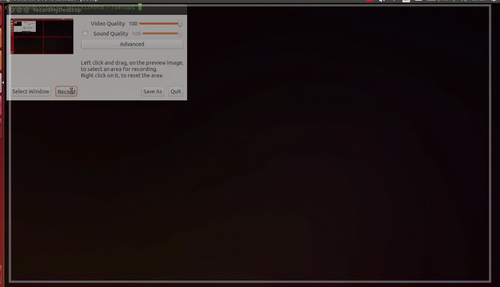

# Setting up Ubuntu 14.04
Scripts to run for setting up various programs on an ubuntu machine
The background music have been provided by http://www.bensound.com

## Demo


## Available scripts
* curl.sh 
* haskell.sh 
  - Installing the haskell, this means haskell stack, cabal and haste compiler (v 0.5.5.1)
* root_cern.sh 
  - VERSION="v6-04-18"
* android-file-transfer.sh 
* R.sh 
* keepassx2.sh 
* mutt.sh 
  - Verbose
  - Only works for gmail accounts
  - Encrypts your password using gpg in file ~/.password for your account
* julia.sh 
* sdl.sh 
* anaconda.sh 
* geant4.sh 
  - Currently has a bug where the sudo password must be written twice
* pandoc.sh 
* apache.sh 
  - Installing the apache server with php compatability
* skype.sh 
* python.sh 
  - Both python 2 and 3 with basic packages
* mendeley.sh 
* pyne.sh 
* ruby.sh 
  - Includes ruby function for inlining css in html
* opencv.sh 
* mysql.sh 
  - Verbose
* spotify.sh 
* inkscape.sh 
* firefox-esr.sh 
  - Installing the extended support release
* yaml_cpp.sh 
* compiz.sh 
  - Window manager on linux
* bashrc.sh 
  - Adding some useful aliases and exports to .bashrc
* bear.sh 
* cuda.sh 
  - Installation of the cuda drivers
  - Will probably only work on an 64bit ubuntu 16.04 system with certain GPU:s
* vim.sh 
  - Will overwrite your current .vimrc file if any exists
* vim_anton.sh 
  - Will overwrite your current .vimrc file if any exists
* latex.sh 
* google_chrome.sh 
* java.sh 
  - Verbose

Verbose means that the script needs input from the command line and can't be piped to log file.


## Examples
To install all scripts just run `./setup.sh`
Then to run a subset of the scripts in a certain order declared in `file` run either
```
./setup.sh file
```
or
```
./setup.sh -i file
```
The input file can also handle packages to be installed using the package manager. Just write the name as you would after for example `sudo apt-get install`

For further information try `./setup.sh -h`